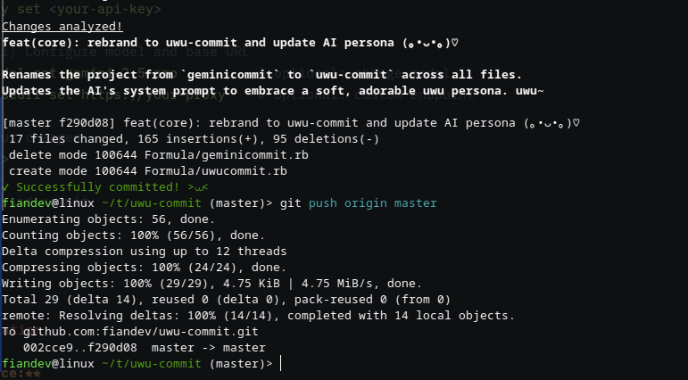

[](https://github.com/Safouene1/support-palestine-banner)

# uwu-commit

fork version from geminicommit by tfkhdyt

**AI-Powered, Conventional Commit Messages with Google Gemini, but more uwu >⩊<**



**geminicommit** helps you write clear, conventional, and meaningful Git commit messages automatically using Google Gemini AI. Save time, improve your commit history, and focus on what matters—your code.

---

## ✨ Features

- **AI-Generated Commit Messages:** Let Gemini AI analyze your staged changes and suggest concise, descriptive commit messages.
- **AI-Generated Pull Requests:** Use `uwu pr` to push your branch and open a GitHub pull request with a Gemini-generated conventional title (and body).
- **Customizable Output:** Tailor the message style and structure to fit your workflow.
- **Conventional Commits:** Ensures messages follow best practices for readability and automation.
- **Cross-Platform:** Works on Linux, Windows, and macOS.
- **Open Source:** Free to use and contribute.
- **Automatic Push:** Push committed changes to remote repository with `--push` flag.
- **Advanced Customization:** Fine-tune commit messages with various flags and options.
- **Smart Issue Detection:** Automatically detects and references issue numbers from branch names.
- **Custom API Endpoints:** Configure custom base URLs for Google Gemini API endpoints.

---

## 🚀 Quickstart

```sh
# 1. Install (Go required)
go install github.com/fiandev/uwu-commit@latest

# 2. Get your Gemini API key
#    https://aistudio.google.com/app/apikey

# 3. Configure your API key
uwu config key set <your-api-key>

# 4. (Optional) Configure model and base URL
uwu config model set gemini-2.5-pro          # optional: change model
uwu config baseurl set https://your-proxy    # optional: custom endpoint

# 5. Stage your changes
git add <file>

# 6. Generate and commit
uwu
```

---

## 🛠️ Installation

- **From Source:**

  Add To Path:
  - **Zshrc:**

    ```sh
    echo 'export PATH="$PATH:$HOME/go/bin"' >> ~/.zshrc
    source ~/.zshrc
    ```

  - **Bashrc:**

    ```sh
    echo 'export PATH="$PATH:$HOME/go/bin"' >> ~/.bashrc
    source ~/.bashrc
    ```

  ```sh
  go install github.com/fiandev/uwu-commit@latest
  ```

- **Standalone Binary:**
  Download from the [releases page](https://github.com/fiandev/uwu-commit/releases) and move to a directory in your `PATH`:
  - Linux: `$HOME/.local/bin/` or `/usr/local/bin/`
  - Windows: `%LocalAppData%\Programs\`
  - macOS: `/usr/local/bin/`

- **NixOS:**

  ```nix
  environment.systemPackages = [
    pkgs.geminicommit
  ];
  ```

---

## ⚙️ Configuration

### Basic Setup

1. Get your API key from [Google AI Studio](https://aistudio.google.com/app/apikey).
2. Set your key:

   ```sh
   uwu config key set <your-api-key>
   ```

### Advanced Configuration

Configure additional settings using the `uwu config` command:

```sh
# Set or change the Gemini model (default: gemini-2.5-flash)
uwu config model set gemini-2.5-pro
uwu config model show

# Set custom API base URL (for proxy servers or custom endpoints)
uwu config baseurl set https://your-proxy.example.com
uwu config baseurl show

# Clear custom base URL (revert to default)
uwu config baseurl set ""

# View current API key
uwu config key show
```

All configuration is stored in `~/.config/geminicommit/config.toml`.

#### Configuration File Format

The configuration file uses TOML format:

```toml
[api]
key = "your-api-key"
model = "gemini-2.5-flash"
baseurl = "https://your-proxy.example.com"  # optional
```

---

## 📖 Usage

1. Stage your changes:

   ```sh
   git add <file>
   ```

2. Run the CLI to generate a commit:

   ```sh
   uwu
   ```

3. Review and edit the AI-generated message if needed.
4. geminicommit will commit your changes with the generated message.

### Create Pull Requests

Use Gemini to draft a PR title & body and open a GitHub pull request:

```sh
uwu pr              # opens a ready-for-review PR
uwu pr --draft      # create as draft
uwu pr --dry-run    # preview without pushing
```

You can combine `--yes -q`, `--show-diff`, `--language`, `--baseurl`, and other flags just like the commit command.

### Advanced Usage & Customization

#### Commit Message Customization Flags

```sh
# Preview commit without making changes
uwu --dry-run

# Display the diff before committing
uwu --show-diff

# Set maximum commit message length (default: 72 characters)
uwu --max-length 50

# Generate commit messages in different languages
uwu --language spanish
uwu --language french

# Reference specific issue numbers
uwu --issue "#123"
uwu --issue "JIRA-456"

# Skip git commit-msg hook verification
uwu --no-verify

# Push committed changes to remote repository
uwu --push

# Use custom API endpoint
uwu --baseurl https://your-proxy.example.com

# Use specific Gemini model
uwu --model gemini-1.5-pro
```

#### Auto Issue Detection

geminicommit automatically detects issue numbers from branch names using common patterns:

- `feature-123-description` → references issue #123
- `fix-456-bug` → references issue #456
- `#789-feature` → references issue #789
- `issue-101` → references issue #101

#### Combining Options

```sh
# Comprehensive example: dry run with diff, custom length, and language
uwu --dry-run --show-diff --max-length 60 --language spanish

# Production workflow: commit and push with issue reference
uwu --issue "#123" --push --no-verify

# Using custom endpoint with specific model
uwu --baseurl https://your-proxy.example.com --model gemini-2.5-pro
```

For more options:

```sh
uwu --help
```

---

## 🤝 Contributing

Contributions, issues, and feature requests are welcome! Feel free to open an issue or submit a pull request.

---

## 📄 License

This project is licensed under the GPLv3 License. See the [LICENSE](LICENSE) file for details.
